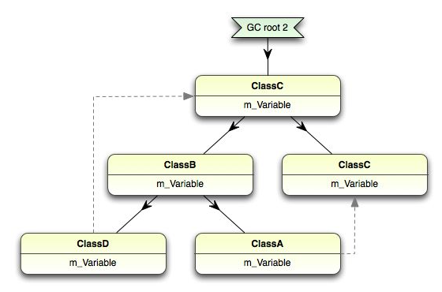

# Understanding Garbage Collection in .NET

---

 

> ## How the Garbage Collector works

 

> How, then, does the garbage collector achieve its magic? The basic idea is pretty simple: it examines how objects are laid out in memory and identifies all those objects that can be ‘reached’ by the running program by following some series of references.

가비지 컬렉션이 시작되면 GC는 GC root라는 래퍼런스 집합들을 살펴본다.

GC root은 몇가지 이유로 프로그램에서 항상 접근이 가능한 메모리들이다.

GC는 root들을 먼저 live로 마킹한 후, root들이 래퍼런싱하고 있는 object들을 찾는다.

그 object들도 live로 마킹하는 식으로 쭉 마킹을 한다.

GC root는 다음과 같다.

- 현재 실행중인 메서드의 지역변수들.
- static 변수들
- unmanaged COM+ 라이브러리로 전달된 managed object들
- finalizer를 가진 object

 

> ## The Object Graph

GC root로부터 래퍼런스들을 이어주면 일종의 object graph가 만들어진다.

> ## Limits of the Garbage Collector

> ### Unused objects that are still referenced

사용하진않지만 reference가 남아 collect되지 않는 object가 있을 수 있음.

그럴땐 지원하는 메모리 프로파일러로 어떤 reference가 남아서 collecting이 안되고 있는지를 찾아야함.

 

> ### Fragmentation of the Heap

다른 object들보다 훨씬 오래 살아남거나 하면, 그리고 런타임에 이런 object들을 옮겨주진 않기때문에 heap에 fragmentation이 생김.

그리고 이러한 hole들은 application이 사용중인 메모리라고 작업관리자에 찍히기때문에 실제보다 훨씬 더 많은 메모리를 사용하게 됨.

 

> ## Performance of the Garbage Collector

GC는 언제든 실행될 수 있기때문에 타이밍이 중요한 application에는 퍼포먼스 이슈가 생길 수 있음.

.NET의 GC는 두가지로 분류됨

- Concurrent
- Synchronous

Concurrent GC는 desktop application 에 사용되고 Synchronous GC는 ASP.NET과 같은 Server Application에 사용됨.

 

> ### Concurrent Mode

GC가 실행될때 어플리케이션 실행을 멈추지않음.

사용자와의 interaction이 중요한 어플리케이션에서 좋음.

 

> ### Synchronous Mode

GC가 실행될때 어플리케이션 실행을 멈춤.

전체적으로는 Concurrent Mode보다 Synchronous Mode가 효율적임.

실행중인 프로그램과 경쟁할 필요가 없어지기때문.

하지만 멈춤이 있으므로 실제로 사용자가 멈춤을 인지할 수 있을 정도임.

 

> ## 순환참조를 잡을수 있는 이유

a,b가 서로를 참조하고 있을 때, a가 지워지면 a는  root가 아니므로 root인 b가 참조하고 있는 동안만 메모리를 유지한다. b가 지워지면 어떤 root도 a를 참조하지 않으므로 a의 메모리는 지워진다.

## 참고자료

[Understanding Garbage Collection in .NET - Simple Talk](https://www.red-gate.com/simple-talk/development/dotnet-development/understanding-garbage-collection-in-net/)

[C# 에서는 순환 참조 문제를 어떻게 해결할까](https://transparentworld.tistory.com/57)
