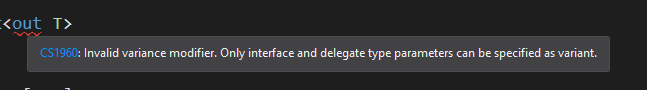

# C# 가변성

---

## 가변성이란

**가변성 Variance**는 **공변성 covariance** 과 **반변성 contravariance** 으로 나뉜다.

공변성은 `A`를 `B`로 변환할 수 있는 형식일 때, `X<A>`를 `X<B>`로 변환할 수 있으면 `X`의 형식 매개변수를 가리키 공변이다라고 한다.

반변성은 `A`를 `B`로 변환할 수 있는 형식일 때, `X<B>`를 `X<A>`로 변환할 수 있으면 `X`의 형식 매개변수를 반변이다라고 한다.

***공변성***
**솔휘**를 **사람**으로 변환할 수 있다. → **솔휘가 사는 집**을 **사람이 사는 집**으로 변환할 수 있다.
공변성은 **출력만 할 수 있게 제한**한다. 그러므로 사람이 사는 집으로 변환했으므로 집에서 나오는 것(출력)은 **사람**으로 제한된다. 원래 솔휘가 사는 집이었으니 출력이 사람이어도 말이 된다.

***반변성***
**솔휘**를 **사람**으로 변환할 수 있다. → **사람이 사는 집**을 **솔휘가 사는 집**으로 변환할 수 있다.
반변성은 **입력만 할 수 있게 제한**한다. 그러므로 솔휘가 사는 집으로 변환했으므로 집으로 들어가는 것(입력)은 **솔휘**로 제한된다. 원래 사람이 사는 집이었으니 입력이 솔휘여도 말이 된다.

C#에서는 디폴트로 형식 매개변수(제네릭)은 가변성이 없는 것으로 간주한다.

다음 예시를 보자.

```cpp
public class Enemy { }

public class Bat : Enemy { }

public class Troll : Enemy { }

public class Stack<T>
{
    int position;
    T[] data = new T[100];
    public void Push(T obj) => data[position++] = obj;
    public T Pop() => data[--position];
}
```

이런 코드가 있고, 

```cpp
public class Test
{
    public static void Main()
    {
        Stack<Troll> trolls = new Stack<Troll>();
        Stack<Enemy> enemies = trolls;
    }
}
```

이렇게 하면 오류가 난다.

왜냐하면 오류가 안난다면 이럴수 있기 때문.

```cpp
enemies.Push(new Bat());
```

하지만 공변성이 없으면 코드의 재사용이 힘들어진다.

`Enemy`의 `Stack`을 받아 모든 `Enemy`의 체력을 깎는 함수가 있다고 하자.

```cpp
public static void DotDamage(Stack<Enemy> enemies)
{
    // ...
}
```

위는 정확히 `Stack<Enemy>`가 들어와야 오류가 안나고 `Stack<Bat>`이 들어오면 오류가 난다.

하지만 아래와 같이 우회방법이 있긴하다.

```cpp
public static void DotDamage<T>(Stack<T> enemies) where T : Enemy
{
    // ...
}
```

## 공변성

C#4.0부터 인터페이스와 대리자의 형식 매개변수를 선언할 때 `out` 수정자를 지정하면 공변 형식 매개변수가 된다.



그냥 클래스에는 안되는 것을 확인했다.

```cpp
public interface IPoppable<**out** T>
{
    T Pop();
}

public class Stack<T> : IPoppable<T>
{
    int position;
    T[] data = new T[100];
    public void Push(T obj) => data[position++] = obj;
    public T Pop() => data[--position];
}
```

`out`은 `T`가 출력위치에만 쓰인다고 컴파일러에게 알려주는 역할이다. 

```cpp
Stack<Troll> trolls = new Stack<Troll>();
IPoppable<Enemy> enemies = trolls;
Enemy enemy = enemies.Pop();
```

형식 매개변수가 공변이므로 컴파일러는 `trolls`에서 `enemies`로의 변환을 허용한다. 

컴파일러가 피하고자 하는 형식 안전성 문제는 `Troll` 형식이 아닌 다른 타입이 `enemies`의 입력으로 쓰이는 것이다. 

하지만 `out` 지정자로 마킹한 인터페이스는 출력 위치에만 형식 매개변수를 사용할 수 있기 때문에 형식 안전성 문제는 일어나지않는다.

```cpp
public static void DotDamage(IPoppable<Enemy> enemies)
{
    // ...
}

public static void Main()
{
    Stack<Troll> trolls = new Stack<Troll>();
    DotDamage(trolls);
}
```

이제 위의 코드가 가능해졌다.

## 반변성

다시한번, 반변성은 `A`를 `B`로 변환할 수 있는 형식일 때, `X<B>`를 `X<A>`로 변환할 수 있으면 `X`의 형식 매개변수를 반변이다라고 한다.

반변성을 갖추려면 형식 매개변수가 오직 입력 위치에만 사용되어야 하는데 형식 매개변수를 `in` 수정자로 지정해야 한다.

```cpp
public interface IPushable<in T>
{
    void Push(T Push);
}

public class Stack<T> : IPoppable<T>, IPushable<T>
{
    int position;
    T[] data = new T[100];
    public void Push(T obj) => data[position++] = obj;
    public T Pop() => data[--position];
}
```

```cpp
Stack<Enemy> enemies = new Stack<Enemy>();
IPushable<Troll> trolls = enemies;
trolls.Push(new Troll());
```

`IPushable`은 그 어떤 멤버도 `T`를 출력 용도로 사용하지 않으므로, `enemies`를 `trolls`로 캐스팅해서 문제가 생기는 상황은 벌어지지 않는다. 예를 들면 해당 인터페이스는 `Enemy`를 출력할 일이 없다.

```cpp
Stack<Enemy> enemies = new Stack<Enemy>();
IPushable<Troll> trolls = enemies;
Bat bat = trolls.Pop(); // error
```

이럴 일이 없다는 것이다.

엄밀히 말하면 `Stack<Enemy>`이므로 `enemies`에는 `Bat` 원소가 있을 수 있다.

하지만 그럴 가능성을 원천봉쇄한 것이다.